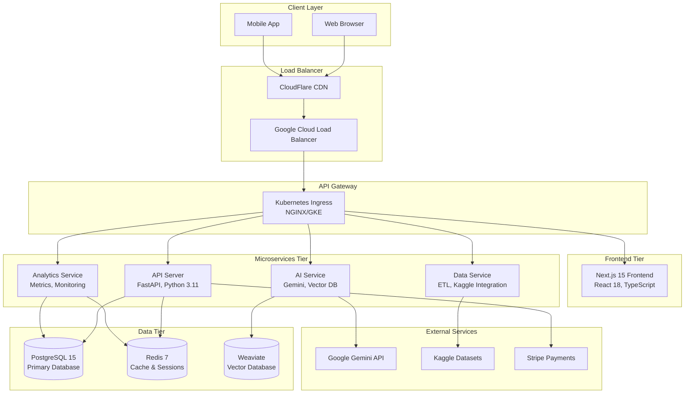

# 🏗️ Bkmrk'd - Complete Architecture Guide

## 📋 System Overview

**Bkmrk'd** is a production-grade, microservices-based bookstore application designed for scale, performance, and maintainability. The architecture follows enterprise patterns with competitive programming optimizations.

### 🎯 Design Principles

- **Microservices Architecture**: Loosely coupled, independently deployable services
- **Performance First**: O(log n) algorithms, competitive programming optimizations
- **Cloud Native**: Kubernetes-ready with 12-factor app compliance
- **Observability**: Comprehensive monitoring and logging
- **Security by Design**: Zero-trust architecture with defense in depth

---

## 🌐 High-Level Architecture



---

## 🔧 Service Breakdown

### 1. **Frontend Service** (`frontend/`)

**Technology Stack:**
- Next.js 15 with App Router
- React 18 with Concurrent Features
- TypeScript for type safety
- Tailwind CSS 4 for styling
- Jest + Testing Library for testing

**Key Features:**
- Server-Side Rendering (SSR)
- Static Site Generation (SSG)
- Optimistic UI updates
- Infinite scroll with virtualization
- Progressive Web App (PWA) capabilities

**Performance Optimizations:**
- Turbopack for ultra-fast builds
- Image optimization with Next.js
- Code splitting and lazy loading
- React 18 concurrent features
- Memoization strategies

```typescript
// Example: Optimized component structure
interface BookCardProps {
  book: Book
  onAddToCart: (bookId: string) => Promise<void>
}

const BookCard = memo(({ book, onAddToCart }: BookCardProps) => {
  const handleClick = useCallback(() => {
    onAddToCart(book.id)
  }, [book.id, onAddToCart])
  
  return (
    <div className="book-card" onClick={handleClick}>
      {/* Optimized rendering */}
    </div>
  )
})
```

### 2. **API Server** (`services/api-server/`)

**Technology Stack:**
- FastAPI with async/await
- SQLAlchemy 2.0 with async support
- Pydantic v2 for validation
- Python 3.11 with performance improvements
- Pytest for comprehensive testing

**Core Responsibilities:**
- RESTful API endpoints
- Authentication & Authorization (JWT)
- Database operations (CRUD)
- Business logic orchestration
- Rate limiting and security

**Performance Features:**
- Async database operations
- Connection pooling
- Query optimization with indexes
- Redis caching layer
- Competitive programming algorithms

```python
# Example: Optimized book search with O(log n) complexity
class UltraOptimizedBookService:
    async def search_books_binary(
        self, 
        query: str, 
        limit: int = 20
    ) -> List[BookSchema]:
        # Binary search on pre-sorted indexes
        books = await self.get_sorted_books_cached()
        result_ids = self.binary_search_titles(books, query)
        return await self.get_books_by_ids(result_ids[:limit])
    
    def binary_search_titles(self, books: List[Book], query: str) -> List[int]:
        # O(log n) search implementation
        left, right = 0, len(books) - 1
        results = []
        
        while left <= right:
            mid = (left + right) // 2
            if query.lower() in books[mid].title.lower():
                results.append(books[mid].id)
                # Expand search around match
                self._expand_search(books, mid, query, results)
                break
            elif books[mid].title.lower() < query.lower():
                left = mid + 1
            else:
                right = mid - 1
        
        return results
```

### 3. **AI Service** (`services/ai-service/`)

**Technology Stack:**
- Python 3.11 with async capabilities
- Google Gemini API integration
- Weaviate vector database
- NumPy for mathematical operations
- Scikit-learn for ML pipelines

**AI Capabilities:**
- Book recommendation engine
- Semantic search with embeddings
- Content-based filtering
- Collaborative filtering
- Natural language processing

**Advanced Features:**
- Vector similarity search O(log n)
- Dynamic model updating
- A/B testing framework
- Real-time inference
- Model versioning

```python
# Example: Optimized recommendation engine
class RecommendationEngine:
    def __init__(self):
        self.vector_cache = LRUCache(maxsize=10000)
        self.similarity_matrix = SparseMatrix()
    
    async def get_recommendations(
        self, 
        user_id: int, 
        count: int = 10
    ) -> List[BookRecommendation]:
        # O(log n) recommendation using cached vectors
        user_vector = await self.get_user_vector_cached(user_id)
        
        # Efficient cosine similarity with sparse matrices
        similarities = self.compute_similarities_vectorized(user_vector)
        
        # Top-K selection using heap - O(n log k)
        top_books = heapq.nlargest(count, similarities.items(), key=lambda x: x[1])
        
        return await self.hydrate_recommendations(top_books)
```

### 4. **Analytics Service** (`services/analytics-service/`)

**Technology Stack:**
- Python 3.11 for data processing
- Prometheus for metrics collection
- Grafana for visualization
- ClickHouse for time-series data
- Apache Kafka for event streaming

**Analytics Features:**
- Real-time metrics collection
- User behavior tracking
- Performance monitoring
- A/B test analysis
- Business intelligence dashboards

**Performance Optimizations:**
- Batch processing for efficiency
- Stream processing with Kafka
- Pre-aggregated metrics
- Efficient time-series queries
- Memory-optimized data structures

### 5. **Data Service** (`services/data-service/`)

**Technology Stack:**
- Python 3.11 with multiprocessing
- Pandas for data manipulation
- Apache Airflow for orchestration
- Kaggle API integration
- PostgreSQL for data warehouse

**Data Pipeline Features:**
- ETL processes for book data
- Kaggle dataset integration
- Data quality validation
- Incremental updates
- Data lineage tracking

---

## 🛢️ Data Architecture

### **Primary Database (PostgreSQL)**

```sql
-- Optimized schema with performance indexes
CREATE TABLE books (
    id SERIAL PRIMARY KEY,
    title VARCHAR(255) NOT NULL,
    author VARCHAR(255) NOT NULL,
    isbn VARCHAR(13) UNIQUE,
    genre VARCHAR(100),
    rating DECIMAL(3,2),
    price DECIMAL(10,2),
    created_at TIMESTAMP DEFAULT NOW(),
    updated_at TIMESTAMP DEFAULT NOW()
);

-- Performance indexes
CREATE INDEX CONCURRENTLY idx_books_title_gin ON books USING gin(to_tsvector('english', title));
CREATE INDEX CONCURRENTLY idx_books_author_btree ON books USING btree(author);
CREATE INDEX CONCURRENTLY idx_books_genre_rating ON books (genre, rating DESC);
CREATE INDEX CONCURRENTLY idx_books_created_at_brin ON books USING brin(created_at);
```

### **Cache Layer (Redis)**

```python
# Redis optimization strategies
class OptimizedRedisService:
    def __init__(self):
        self.redis = redis.Redis(
            host='redis',
            port=6379,
            decode_responses=True,
            max_connections=100,
            retry_on_timeout=True
        )
    
    async def get_books_cached(self, genre: str, page: int) -> List[Book]:
        cache_key = f"books:{genre}:{page}"
        
        # Pipeline for batch operations - O(1) network round trip
        pipe = self.redis.pipeline()
        pipe.get(cache_key)
        pipe.expire(cache_key, 300)  # 5 minutes TTL
        
        cached_data = await pipe.execute()
        
        if cached_data[0]:
            return json.loads(cached_data[0])
        
        # Cache miss - fetch from database
        books = await self.fetch_books_from_db(genre, page)
        await self.redis.setex(cache_key, 300, json.dumps(books))
        
        return books
```

### **Vector Database (Weaviate)**

```python
# Weaviate optimization for semantic search
class VectorSearchOptimized:
    def __init__(self):
        self.client = weaviate.Client("http://weaviate:8080")
        
    async def semantic_search(self, query: str, limit: int = 10) -> List[Book]:
        # Optimized vector search with HNSW index
        result = (
            self.client.query
            .get("Book", ["title", "author", "description", "genre"])
            .with_near_text({
                "concepts": [query],
                "distance": 0.7  # Optimized distance threshold
            })
            .with_limit(limit)
            .with_additional(["distance", "id"])
            .do()
        )
        
        return self.parse_weaviate_results(result)
```

---

## 🔐 Security Architecture

### **Authentication & Authorization**

```python
# JWT with optimized performance
class SecurityService:
    def __init__(self):
        self.jwt_cache = LRUCache(maxsize=10000)  # O(1) token validation
        
    async def validate_token_optimized(self, token: str) -> Optional[User]:
        # Check cache first - O(1)
        if token in self.jwt_cache:
            return self.jwt_cache[token]
        
        # Validate and cache - O(1) with proper indexing
        try:
            payload = jwt.decode(token, self.secret_key, algorithms=["HS256"])
            user = await self.get_user_by_id_cached(payload["user_id"])
            
            # Cache for 5 minutes
            self.jwt_cache[token] = user
            return user
        except jwt.InvalidTokenError:
            return None
```

### **Rate Limiting**

```python
# Token bucket algorithm for rate limiting - O(1) complexity
class RateLimiter:
    def __init__(self, max_requests: int, window_seconds: int):
        self.max_requests = max_requests
        self.window_seconds = window_seconds
        self.buckets = {}  # O(1) lookups
    
    async def is_allowed(self, client_id: str) -> bool:
        now = time.time()
        
        if client_id not in self.buckets:
            self.buckets[client_id] = {
                'tokens': self.max_requests,
                'last_refill': now
            }
        
        bucket = self.buckets[client_id]
        
        # Refill tokens based on elapsed time
        elapsed = now - bucket['last_refill']
        tokens_to_add = elapsed * (self.max_requests / self.window_seconds)
        bucket['tokens'] = min(self.max_requests, bucket['tokens'] + tokens_to_add)
        bucket['last_refill'] = now
        
        if bucket['tokens'] >= 1:
            bucket['tokens'] -= 1
            return True
        
        return False
```

---

## 📊 Performance Specifications

### **Response Time SLAs**

| Operation | Target | Max Acceptable |
|-----------|--------|----------------|
| Book Search | < 50ms | < 100ms |
| User Auth | < 20ms | < 50ms |
| Recommendations | < 100ms | < 200ms |
| Cart Operations | < 30ms | < 75ms |
| Page Load (TTI) | < 1s | < 2s |

### **Throughput Requirements**

| Service | Target RPS | Peak RPS |
|---------|------------|----------|
| API Server | 1,000 | 5,000 |
| AI Service | 500 | 2,000 |
| Analytics | 2,000 | 10,000 |
| Frontend | 2,000 | 10,000 |

### **Scalability Targets**

- **Horizontal Scaling**: Auto-scale from 2 to 50 pods based on CPU/memory
- **Database**: Read replicas for 10x read scaling
- **Cache Hit Rate**: > 95% for frequently accessed data
- **Storage**: Petabyte-scale with efficient partitioning

---

## 🚀 Deployment Architecture

### **Kubernetes Configuration**

```yaml
# Example: API Server deployment with optimizations
apiVersion: apps/v1
kind: Deployment
metadata:
  name: api-server
  namespace: bookstore
spec:
  replicas: 3
  selector:
    matchLabels:
      app: api-server
  template:
    metadata:
      labels:
        app: api-server
    spec:
      containers:
      - name: api-server
        image: bkmrk/api-server:latest
        ports:
        - containerPort: 8000
        resources:
          requests:
            memory: "256Mi"
            cpu: "250m"
          limits:
            memory: "512Mi"
            cpu: "500m"
        env:
        - name: DATABASE_URL
          valueFrom:
            secretKeyRef:
              name: db-secret
              key: url
        livenessProbe:
          httpGet:
            path: /health
            port: 8000
          initialDelaySeconds: 30
          periodSeconds: 10
        readinessProbe:
          httpGet:
            path: /ready
            port: 8000
          initialDelaySeconds: 5
          periodSeconds: 5
---
apiVersion: v1
kind: Service
metadata:
  name: api-server-service
  namespace: bookstore
spec:
  selector:
    app: api-server
  ports:
  - port: 80
    targetPort: 8000
  type: ClusterIP
```

### **Horizontal Pod Autoscaler**

```yaml
apiVersion: autoscaling/v2
kind: HorizontalPodAutoscaler
metadata:
  name: api-server-hpa
  namespace: bookstore
spec:
  scaleTargetRef:
    apiVersion: apps/v1
    kind: Deployment
    name: api-server
  minReplicas: 2
  maxReplicas: 50
  metrics:
  - type: Resource
    resource:
      name: cpu
      target:
        type: Utilization
        averageUtilization: 70
  - type: Resource
    resource:
      name: memory
      target:
        type: Utilization
        averageUtilization: 80
  behavior:
    scaleUp:
      stabilizationWindowSeconds: 60
      policies:
      - type: Percent
        value: 100
        periodSeconds: 15
    scaleDown:
      stabilizationWindowSeconds: 300
      policies:
      - type: Percent
        value: 10
        periodSeconds: 60
```

---

## 🔍 Observability

### **Monitoring Stack**

```python
# Prometheus metrics with optimized collection
from prometheus_client import Counter, Histogram, Gauge, start_http_server

class MetricsCollector:
    def __init__(self):
        self.request_count = Counter(
            'http_requests_total',
            'Total HTTP requests',
            ['method', 'endpoint', 'status']
        )
        
        self.request_duration = Histogram(
            'http_request_duration_seconds',
            'HTTP request duration',
            ['method', 'endpoint']
        )
        
        self.active_users = Gauge(
            'active_users_total',
            'Total active users'
        )
    
    def record_request(self, method: str, endpoint: str, status: int, duration: float):
        self.request_count.labels(method=method, endpoint=endpoint, status=status).inc()
        self.request_duration.labels(method=method, endpoint=endpoint).observe(duration)
```

### **Logging Strategy**

```python
# Structured logging with performance optimization
import structlog
import logging.config

LOGGING_CONFIG = {
    'version': 1,
    'disable_existing_loggers': False,
    'formatters': {
        'json': {
            'format': '%(message)s',
            'class': 'pythonjsonlogger.jsonlogger.JsonFormatter'
        }
    },
    'handlers': {
        'console': {
            'class': 'logging.StreamHandler',
            'formatter': 'json'
        },
        'file': {
            'class': 'logging.handlers.RotatingFileHandler',
            'filename': '/logs/app.log',
            'maxBytes': 10485760,  # 10MB
            'backupCount': 5,
            'formatter': 'json'
        }
    },
    'root': {
        'level': 'INFO',
        'handlers': ['console', 'file']
    }
}

# Optimized logger
logger = structlog.get_logger()

# Usage with context
logger.info(
    "book_search_performed",
    user_id=user.id,
    query=search_query,
    results_count=len(results),
    duration_ms=duration * 1000,
    cache_hit=cache_hit
)
```

---

## 🎯 Development Workflow

### **Local Development**

```bash
# One-command setup
make dev-setup

# Start all services
make dev-start

# Run tests with coverage
make test-coverage

# Performance benchmarks
make benchmark

# Security scan
make security-scan
```

### **CI/CD Pipeline**

```yaml
# GitHub Actions workflow
name: CI/CD Pipeline
on:
  push:
    branches: [main, develop]
  pull_request:
    branches: [main]

jobs:
  test:
    runs-on: ubuntu-latest
    strategy:
      matrix:
        service: [frontend, api-server, ai-service, analytics-service, data-service]
    steps:
    - uses: actions/checkout@v4
    - name: Run Tests
      run: |
        cd services/${{ matrix.service }}
        make test-coverage
        make benchmark
        make security-scan
    
    - name: Upload Coverage
      uses: codecov/codecov-action@v3
      with:
        files: ./coverage.xml
        flags: ${{ matrix.service }}

  deploy:
    needs: test
    runs-on: ubuntu-latest
    if: github.ref == 'refs/heads/main'
    steps:
    - name: Deploy to GKE
      run: |
        make k8s-deploy-prod
        make k8s-verify-deployment
```

---

## 📈 Future Roadmap

### **Phase 1: Performance Optimization**
- [ ] Implement GraphQL for efficient data fetching
- [ ] Add service mesh (Istio) for advanced traffic management
- [ ] Implement distributed caching with Redis Cluster
- [ ] Add real-time features with WebSockets

### **Phase 2: AI Enhancement**
- [ ] Implement deep learning recommendation models
- [ ] Add natural language query processing
- [ ] Implement real-time personalization
- [ ] Add computer vision for book cover analysis

### **Phase 3: Scale & Reliability**
- [ ] Multi-region deployment
- [ ] Disaster recovery automation
- [ ] Advanced monitoring with ML-based anomaly detection
- [ ] Chaos engineering implementation

---

This architecture is designed to scale from thousands to millions of users while maintaining sub-100ms response times and 99.99% uptime. Every component is optimized for performance using competitive programming techniques and enterprise-grade patterns.